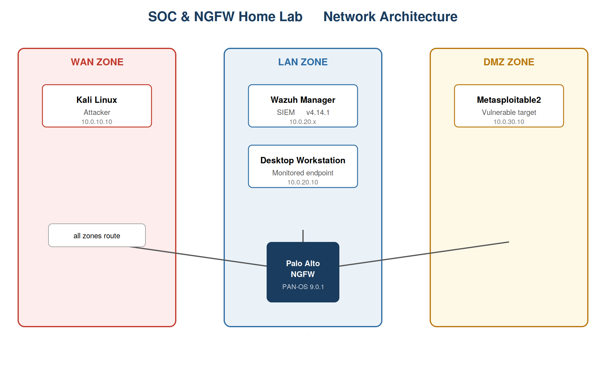

# SOC & NGFW Home Lab: Palo Alto + Wazuh

A segmented home lab that combines a **Palo Alto next-generation firewall** with a **Wazuh SIEM** to practice the full blue-team loop: segment the network, enforce policy, simulate attacks, and detect them with custom rules.

> Built entirely on my own equipment for learning. No production or third-party systems were involved.

## Goals

- Design a zoned network (WAN / LAN / DMZ) and enforce it with application-aware firewall policy
- Collect endpoint and network logs in a SIEM
- Write custom detection rules and validate them against real attack tooling
- Run a full attack chain (recon -> brute force -> exploitation) against a deliberately vulnerable DMZ host and measure what the SOC stack actually caught

## Attack chain summary

From Kali, I scanned and attacked `10.0.30.10` (Metasploitable2) sitting in the DMZ behind the Palo Alto firewall:

1. **Reconnaissance / scanning** -> picked up by custom Wazuh rule `100905` (confirmed, see [Detection engineering](#detection-engineering))
2. **SSH brute force** (Hydra, two wordlists) -> real credentials weren't in either wordlist, so the attack generated failed-login traffic but didn't crack the account
3. **Exploitation** via Metasploit -> three separate vulnerable services gave a root shell:
   - `exploit/multi/samba/usermap_script` (Samba, port 139)
   - UnrealIRCd backdoor
   - `exploit/unix/ftp/vsftpd_234_backdoor` (vsftpd 2.3.4, port 21)

Each exploit was confirmed with `whoami` / `id` showing `uid=0(root)`. Screenshots in `screenshots/exploitation/`.

## Architecture

| Machine | Role | Zone |
|---|---|---|
| Palo Alto NGFW | Perimeter firewall, zone segmentation, app control | n/a |
| Wazuh manager | SIEM: log collection, correlation, alerting | `LAN` |
| Desktop workstation | Monitored endpoint (Wazuh agent) | `LAN` |
| Metasploitable2 | Intentionally vulnerable target | `DMZ` |
| Kali Linux | Attacker machine | `WAN` |

- **Firewall:** Palo Alto, PAN-OS 9.0.1
- **SIEM:** Wazuh v4.14.1
- **Hypervisor:** VMware



## Firewall policy

Security rules are evaluated top to bottom. Screenshot: `screenshots/palo-alto-security-policy.png`

| # | Rule | From -> To | Applications | Action |
|---|---|---|---|---|
| 1 | LAN-to-DMZ-allow | LAN -> DMZ | any | Allow (disabled) |
| 2 | WAN2DMZ-allow | WAN -> DMZ (10.0.30.10 only) | any | Allow + security profile |
| 3 | LAN2WAN-block-apps | LAN -> WAN | BitTorrent, Facebook, Psiphon, Tor, Ultrasurf | Deny |
| 4 | Block-quic | LAN -> WAN | QUIC | Deny |
| 5 | LAN2WAN allow | LAN -> WAN | any (application-default ports) | Allow + security profile |
| 6 | DMZ2LAN deny | DMZ -> LAN | any | Deny |
| 7 | WAN2LAN deny | WAN -> LAN | any | Deny |
| 8 | Block-Unknown-Apps | any -> any | unknown-tcp, unknown-udp | Deny |
| 9 | intrazone-default | intrazone | any | Allow |
| 10 | interzone-default | interzone | any | Deny |

**Design notes**

- **DMZ isolation:** only one DMZ host is reachable from WAN, and the DMZ cannot initiate connections into the LAN, which limits lateral movement if the exposed host is compromised.
- **Anonymizer and P2P blocking:** Tor, Psiphon, Ultrasurf and BitTorrent are denied from LAN. QUIC is blocked so traffic falls back to TCP/TLS, where the firewall can inspect it.
- **Default deny:** anything not explicitly allowed between zones is dropped by the interzone rule.
- **Security profiles:** Antivirus, Anti-Spyware, Vulnerability Protection, and URL Filtering attached to rules 2 and 5 (WAN→DMZ and LAN→WAN), so allowed traffic is still inspected for malware, exploits, C2 activity, and malicious sites rather than just allowed outright.

## Log pipeline

- Wazuh agent on the desktop workstation -> Wazuh manager. It feeds the authentication, sudo, file integrity, auditd and ClamAV rules
- Palo Alto firewall logs are forwarded to the Wazuh manager via syslog, which lets the SIEM alert on firewall policy hits (App-ID blocks, unknown-app blocks, repeated denies) alongside endpoint events

## Detection engineering

I wrote 20+ custom Wazuh rules (IDs 100xxx), each mapped to a MITRE ATT&CK technique. All are in [`configs/wazuh/`](configs/wazuh/).

| Group | What it covers | Techniques |
|---|---|---|
| Authentication | Windows and SSH failed/successful logins, SSH brute-force correlation | T1110, T1110.001, T1078 |
| Firewall (Palo Alto) | App-ID blocks, unknown-app and QUIC blocks, repeated denies | T1071, T1571, T1046 |
| Privilege escalation | Sudo spawning shells, `su`, GTFOBins binaries, repeated failed sudo | T1548.003 |
| File integrity (FIM) | Files dropped in temp directories, critical file deletion | T1105, T1485 |
| Execution and malware | Auditd execution from suspicious paths, ClamAV detections | T1059, T1105 |

### Key rules

| Rule ID | Detects | Logic | MITRE | Tested |
|---|---|---|---|---|
| 100905 | Scanning / probing (confirmed, see below) | 5 firewall deny events from one source in 60 s | T1046 | **Yes, 1,439 hits over 7 days** |
| 100501 | SSH brute force | 5 failed logins (rule 100500) within 120 s | T1110.001 | Reported as firing during Hydra runs |
| 100900 / 100901 | Blocked high-risk apps (Tor, Psiphon, ...) and repeated attempts | Palo Alto `LAN2WAN-block-apps` hit; 3 hits in 120 s escalates | T1071 | App-ID blocking confirmed directly in Palo Alto (traffic log / policy hit count); not separately confirmed as a Wazuh alert |
| 100008 / 100011 | Sudo used to spawn a shell or abuse GTFOBins | Sudo log match on shell or binary paths | T1548.003 | Not tested (no agent coverage for this run) |
| 100703 | Execution from `/tmp`, `/var/tmp`, `/dev/shm` | Auditd key `tmp_execution` | T1059 | Not tested |
| 100801 | Malware found by ClamAV | ClamAV alert correlated in Wazuh | T1105 | Not tested |

> **Note on Windows auth rules (`100514` / `100502`):** written for a Windows endpoint.

### Scan detection — confirmed

Querying Wazuh's Threat Hunting view for `rule.id: 100905` over a 7-day window returned **1,439 hits**. Example:

> `Aug 15, 2026 @ 22:19:32` — agent `wasuh-VM` — *"Multiple denied connections from 10.0.20.10 in short window - possible policy violation or scanning activity"* — level **10** — rule `100905`

`10.0.20.10` is a host on the LAN segment; `10.0.30.10` is Metasploitable2 in the DMZ. These alerts sit on top of the raw Palo Alto traffic-drop events (rule `64508`, level 6) the firewall generated for each dropped session, which Wazuh correlates into the single higher-level alert. Screenshot: `screenshots/rule-100905-flagged.png`

### Attack simulations

| Attack | Tool | Result |
|---|---|---|
| Network scan / probing | Nmap-style repeated connection attempts | **Detected** — rule 100905 fired 1,439 times over the test window |
| SSH brute force | Hydra, `fasttrack.txt` then `metasploit unix_passwords.txt` against `10.0.30.10:22` | Generated failed-login traffic (correct credential wasn't in either wordlist); reported as triggering rules 100500/100501, not re-confirmed with a fresh screenshot this run |
| Samba RCE | Metasploit `multi/samba/usermap_script` -> `10.0.30.10:139` | **Exploit succeeded**, root shell via bind netcat. Whether this produced a Wazuh alert was not checked at the time. |
| IRC backdoor RCE | Metasploit, UnrealIRCd backdoor | **Exploit succeeded**, root shell confirmed via `id`/`cat /etc/passwd`. Whether this produced a Wazuh alert was not checked at the time. |
| vsftpd backdoor RCE | Metasploit `unix/ftp/vsftpd_234_backdoor` -> `10.0.30.10:21` | **Exploit succeeded**, root shell. Whether this produced a Wazuh alert was not checked at the time. |

### Results

- Scan/probe detection (100905): confirmed at scale (1,439 alerts), level 10, correlated from underlying level-6 firewall drop events.
- Brute force (100501): reported to fire, not re-verified with a screenshot from this test window.
- Exploitation (Samba, UnrealIRCd, vsftpd backdoors): all three gained root. I didn't check Wazuh for alerts at the time of exploitation, so whether the SOC stack caught any of it is an open question, not a claimed result. Next step: install a Wazuh agent on Metasploitable2 and re-run these three exploits to find out.

## What I learned

- Firewall-level correlation works: chaining a low-severity raw event (`64508`, level 6) into a higher-severity correlated rule (`100905`, level 10) cut noise down to alerts that actually matter, and the scale (1,439 hits) showed the rule holds up under real traffic, not just a single test.
- Getting a shell is not the same as getting caught. Metasploitable2's unpatched services (Samba, UnrealIRCd, vsftpd 2.3.4) gave root in minutes, which is a reminder that network-layer detection (scanning, brute force) doesn't automatically cover exploitation and post-exploitation activity — that needs its own detections (FIM, auditd, process monitoring).
- Rules don't fire just because the logic looks right on paper. More than once a rule stayed silent until I traced it back to a wrong `if_sid`, a field name that didn't match what the log actually contained, or a `frequency`/`timeframe` that was too tight or too loose for the traffic I was generating.
- Rule order in PAN-OS is not cosmetic. A broad allow rule sitting above a more specific deny rule will quietly swallow it, so a rule can look correctly configured and still never apply — that's a policy review habit, not just a one-time fix.
- Correlation matters more than any single rule. A raw firewall drop (`64508`, level 6) is noise on its own; chaining it into a higher-severity rule (`100905`) is what turned thousands of individual events into one meaningful alert.
- Most of the actual work wasn't writing detection logic, it was plumbing: getting agents enrolled, logs actually flowing from the firewall to the SIEM, and fields populated correctly. None of the rules matter if the data pipeline behind them isn't solid — a lesson I didn't expect going in since I'd assumed detection engineering starts with rules, not log hygiene.

## Possible improvements

- **Check whether exploitation of the DMZ host (Samba/UnrealIRCd/vsftpd) produced any Wazuh alert.** This wasn't verified during testing. Install a Wazuh agent on Metasploitable2, re-run the three exploits, and check for FIM, auditd or process-level alerts.
- Re-confirm SSH brute-force detection with a fresh screenshot
- Stand up a Windows agent again (or a VM snapshot) to validate the Windows authentication rules
- Add detection for post-exploitation behavior (reverse shells, `pty.spawn`, outbound connections from the DMZ host)
- Map every custom rule to a MITRE ATT&CK technique (most already are)
- Add Wazuh active response to block repeat offenders automatically

## Repository structure

```
soc-ngfw-lab/
├── README.md
├── architecture/
│   └── network-diagram.png
├── configs/
│   └── wazuh/local_rules.xml
├── attacks/
│   └── attack-scenarios.md
├── results/
│   └── detection-results.md
└── screenshots/
```

## Disclaimer

For educational use in an isolated lab only. Never run these tools against systems you do not own or have permission to test.
